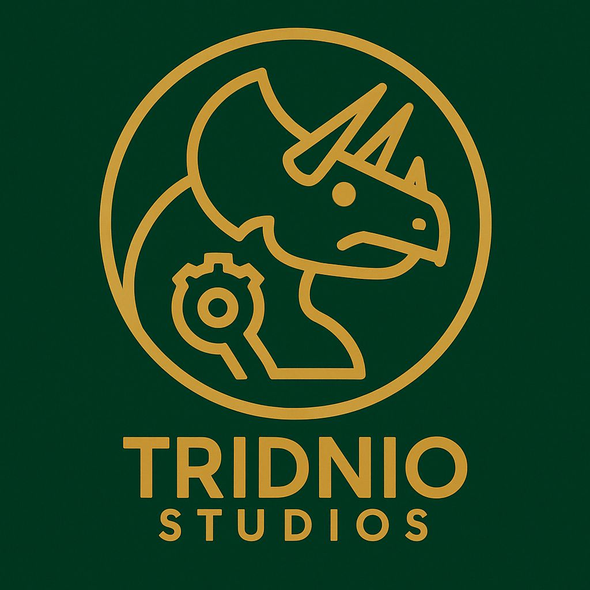

# 🚀 Tridnio Studios

  
  
  
  
  

## 📋 About Us

Tridnio Studios is a Costa Rica-based software development and technical services company founded by a team of passionate technologists committed to delivering innovative solutions for businesses worldwide. Since our inception, we have focused on combining technical excellence with a deep understanding of business needs to create solutions that drive real value for our clients.

Our team brings together expertise in software development, automation, cloud technologies, and digital marketing to provide comprehensive services that address the full spectrum of technology challenges.

Operating from Costa Rica gives us a unique perspective and advantage. We combine the innovation and technical capabilities expected from global technology leaders with the warmth, creativity, and dedication to service that characterizes Costa Rican culture.

## 🎯 Our Mission

> To empower businesses through innovative technology solutions that drive efficiency, growth, and competitive advantage.

We are committed to understanding each client's unique challenges and opportunities, delivering tailored solutions that address specific needs rather than one-size-fits-all approaches. Our goal is to be a trusted technology partner that helps businesses transform their operations and achieve their strategic objectives.

## 🔮 Our Vision

> To be recognized globally as a leading provider of innovative technology solutions, bridging the gap between technical possibilities and business realities.

We envision a future where businesses of all sizes can leverage cutting-edge technology to achieve their full potential. As technology evolves, we strive to stay at the forefront of innovation, continuously expanding our capabilities to offer solutions that address emerging challenges and opportunities.

## 💫 Our Values

<table>
  <tr>
    <td align="center"><b>Excellence</b></td>
    <td align="center"><b>Innovation</b></td>
    <td align="center"><b>Integrity</b></td>
  </tr>
  <tr>
    <td>Delivering solutions of the highest quality, exceeding expectations through attention to detail and continuous improvement.</td>
    <td>Embracing creativity and forward thinking, constantly exploring new technologies and approaches.</td>
    <td>Operating with honesty, transparency, and ethical conduct in all our interactions.</td>
  </tr>
  <tr>
    <td align="center"><b>Client Focus</b></td>
    <td align="center"><b>Collaboration</b></td>
    <td align="center"><b>Adaptability</b></td>
  </tr>
  <tr>
    <td>Putting our clients at the center of everything we do, striving to understand their needs.</td>
    <td>Believing in the power of teamwork, fostering an environment where diverse perspectives combine.</td>
    <td>Embracing change and remaining flexible, continuously evolving our approaches.</td>
  </tr>
</table>

## 🛠️ Our Services

### 💻 Software Development
- ✨ Custom desktop, mobile, and web applications
- 🔄 Cross-platform solutions
- 🎨 User-centered design
- 📈 Scalable architecture
- 🔧 Ongoing support & maintenance
- ⚡ Agile development methodology

### 🤖 Robotic Process Automation (RPA)
- ⚙️ Automate repetitive tasks with UiPath and Power Automate
- 📊 Process analysis & optimization
- 🤖 Bot development & implementation
- 🔄 Integration with existing systems
- 🛠️ Maintenance & support
- 📈 ROI monitoring

### ☁️ SaaS Solutions
- 🌐 Cloud-based software solutions
- 📦 Inventory management
- 🛍️ Order processing
- 📊 Analytics & reporting
- 👥 Customer relationship management
- 🔒 Secure cloud infrastructure

### 🤝 Outsourcing
- 👨‍💻 Access our skilled professionals
- 🎯 Experienced developers
- ✅ Quality assurance teams
- 📊 Data analysts
- 🔄 Flexible engagement models
- 🤝 Seamless collaboration

### 🌐 WordPress Development
- 🎨 Professional WordPress websites
- 🔧 Website maintenance and updates
- 🔌 Plugin integration
- 🛍️ E-commerce solutions
- ⚡ Performance optimization
- 📱 Responsive design

### 📱 Social Media Management
- ⚙️ Technical setup and management
- 📅 Social media post scheduling
- 📊 Analytics and engagement tracking
- 🎯 Campaign setup and management
- 💰 Paid advertising implementation
- 📈 Performance reporting

### 📧 Email Marketing
- ⚙️ Technical implementation with Mailchimp
- 📨 Mailchimp campaign implementation
- 🌐 Custom domain integration
- 📝 Contact database setup
- 🔄 List maintenance and management
- ⚡ Automation configuration

## ⭐ Why Choose Tridnio Studios?

  <table>
    <tr>
      <td align="center">
        <b>Technical Excellence</b> 
        <i>Deep technical expertise</i>
      </td>
      <td align="center">
        <b>Innovation Focus</b> 
        <i>Cutting-edge solutions</i>
      </td>
      <td align="center">
        <b>Client-Centric Approach</b> 
        <i>Understanding your needs</i>
      </td>
    </tr>
    <tr>
      <td align="center">
        <b>Global Perspective</b> 
        <i>Unique blend of standards</i>
      </td>
      <td align="center">
        <b>Comprehensive Solutions</b> 
        <i>End-to-end service</i>
      </td>
      <td align="center">
        <b>Quality Assurance</b> 
        <i>Rigorous testing</i>
      </td>
    </tr>
  </table>

## 🤝 Our Commitment

We are dedicated to:
- ✅ Delivering high-quality, scalable solutions
- 💬 Maintaining transparent communication
- 📋 Ensuring project success through careful planning
- 🤝 Building long-term partnerships
- 🔄 Continuous innovation and improvement

## 📞 Contact Us

  <h3>Ready to transform your business?</h3>
  
Get in touch with us to discuss your project and discover how we can help you achieve your goals.

  
  
  
  

---

  <i>Tridnio Studios - Innovating Technology Solutions for a Better Tomorrow</i>

 
